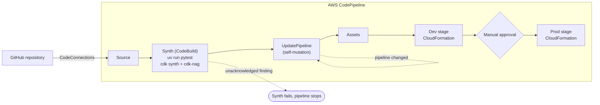
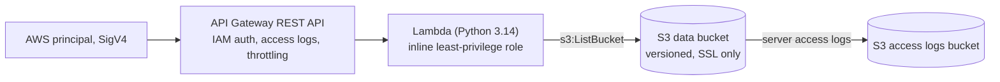

# cdk-python-nag-pipeline-lab

> **Personal lab / demonstration. Not client code.**

An AWS CDK v2 app in Python, deployed by a self-mutating CDK Pipelines pipeline on AWS CodePipeline. cdk-nag runs
the AWS Solutions rule pack during synth, so any finding that is not acknowledged in code fails the synth and stops
the pipeline before anything reaches CloudFormation.

## What it demonstrates

- **CDK Pipelines in Python**: source from a CodeConnections (CodeStar) connection, a synth step, self-mutation, a
  dev stage and a prod stage.
- **cdk-nag as a hard gate**: `AwsSolutionsChecks` is registered once on the whole app. An unacknowledged finding
  makes `cdk synth` exit non-zero, locally, in CI and inside the pipeline.
- **Suppressions with reasons, kept in code**: each accepted finding is acknowledged next to the resource it covers,
  with a written reason. No blanket, stack-wide suppressions.
- **Template assertions**: pytest checks the synthesized CloudFormation with `aws_cdk.assertions.Template`, plus a
  test that fails if cdk-nag reports anything.
- **Manual approval before production**: a `ManualApprovalStep` runs before the prod stage deploys.

## Architecture



Stage order: `Source`, `Build` (synth), `UpdatePipeline`, `Assets`, `Dev`, `Prod`. The first action in `Prod` is the
manual approval `PromoteToProd`.

Each stage deploys the same workload stack:



An example of an acknowledged finding, from `service/service_stack.py`:

```python
Validations.of(method).acknowledge(
    Acknowledgment(
        id="AwsSolutions::AwsSolutions-COG4",
        reason=(
            "The method uses IAM (SigV4) authorization. Callers are AWS "
            "principals, so a Cognito user pool authorizer does not apply."
        ),
    )
)
```

## Repository layout

```text
app.py                         entry point, registers AwsSolutionsChecks on the whole app
pipeline/pipeline_stack.py     CodePipeline source, synth step, stages, manual approval
pipeline/nag_suppressions.py   acknowledged findings on IAM policies that CDK Pipelines generates
service/service_stack.py       workload: S3 buckets, Lambda, API Gateway, least-privilege role,
                               each acknowledged finding next to its resource
service/runtime/handler.py     Lambda handler
tests/unit/                    pytest with aws_cdk.assertions, plus the cdk-nag gate tests
docs/nag-findings.md           how to read a finding and when an acknowledgment is acceptable
cdk.json, pyproject.toml, uv.lock
.pre-commit-config.yaml        ruff, ruff-format, gitleaks, markdownlint, actionlint, whitespace
.github/workflows/ci.yml       ruff, pytest and cdk synth on pull requests, no AWS credentials
```

## Versions

Python 3.12+, managed with [uv](https://docs.astral.sh/uv/). Pinned in `pyproject.toml` and `uv.lock`:
`aws-cdk-lib` 2.271.0, `cdk-nag` 3.0.2, `constructs` 10.8.1. CDK CLI 2.1143.0 through `npx`.

cdk-nag 3 plugs into CDK's policy validation (`Validations.of(app).add_plugins(...)`) and replaces the older
`NagSuppressions` API with `Validations.of(construct).acknowledge(...)`.

## How to run it

### Local checks (no AWS account needed)

```bash
uv sync
uv run ruff check
uv run pytest
npx aws-cdk@2.1143.0 synth --quiet \
  -c account=123456789012 \
  -c region=us-east-1 \
  -c repository=example-org/cdk-python-nag-pipeline-lab \
  -c connection_arn=arn:aws:codeconnections:us-east-1:123456789012:connection/00000000-0000-0000-0000-000000000000
```

`123456789012` is the AWS documentation example account. Synth needs no credentials because every value comes from
context.

### Deploy the pipeline

1. Fork this repository.
2. In the AWS console, create a CodeConnections connection to GitHub and complete the handshake. Copy its ARN.
3. Bootstrap the account (placeholders shown):

   ```bash
   npx aws-cdk@2.1143.0 bootstrap aws://YOUR_AWS_ACCOUNT_ID/YOUR_REGION
   ```

4. Deploy the pipeline stack once from your machine:

   ```bash
   npx aws-cdk@2.1143.0 deploy NagLabPipeline \
     -c account=YOUR_AWS_ACCOUNT_ID \
     -c region=YOUR_REGION \
     -c repository=YOUR_GITHUB_OWNER/cdk-python-nag-pipeline-lab \
     -c connection_arn=YOUR_CONNECTION_ARN
   ```

5. Push to `main`. From then on the pipeline updates itself: the synth step passes the same context values to
   `cdk synth`, and `UpdatePipeline` applies any change to the pipeline before the stages deploy.
6. Approve `PromoteToProd` in the CodePipeline console to deploy the prod stage.

Context keys: `account`, `region`, `repository` and `connection_arn` are required; `branch` defaults to `main`. The
app refuses to synth when one is missing.

To call the API, sign the request with SigV4, for example with
[awscurl](https://github.com/okigan/awscurl): `awscurl --service execute-api https://API_ID.execute-api.YOUR_REGION.amazonaws.com/v1/objects`.

## Try the gate

Create a branch and add a bucket without logging or an SSL-only policy to `ServiceStack`:

```python
s3.Bucket(self, "UnsafeBucket")
```

`cdk synth` (and `uv run pytest`) now fail with output like:

```text
ERROR The S3 Bucket has server access logs disabled. (AwsSolutions)
   NagLabPipeline/Dev/Service/UnsafeBucket/Resource aws-cdk-lib.aws_s3.CfnBucket
   Acknowledge with 'AwsSolutions::AwsSolutions-S1'

ERROR The S3 Bucket or bucket policy does not require requests to use SSL. (AwsSolutions)
   NagLabPipeline/Dev/Service/UnsafeBucket/Resource aws-cdk-lib.aws_s3.CfnBucket
   Acknowledge with 'AwsSolutions::AwsSolutions-S10'
```

Opened as a pull request, the CI job fails at the pytest step. Pushed to `main`, the pipeline stops at `Synth` and
nothing is deployed. Fix the resource or, if the finding is accepted, acknowledge it next to the resource with a
reason (see [docs/nag-findings.md](docs/nag-findings.md)).

## Cost and teardown

The pipeline, a KMS key (about USD 1 per month), CodeBuild minutes per run, and two copies of a small serverless
workload. Delete in this order:

1. The stage stacks: `Prod-Service`, then `Dev-Service` (CloudFormation console, or
   `aws cloudformation delete-stack --stack-name Prod-Service`).
2. The pipeline stack: `npx aws-cdk@2.1143.0 destroy NagLabPipeline -c ...` with the same context.
3. The CodeConnections connection, if you created it for this lab.

Buckets use `auto_delete_objects`, so stack deletion empties them. The API Gateway CloudWatch Logs role is retained
because it is an account-level setting that both stages share; delete it by hand when nothing else uses it. The CDK
bootstrap stack (`CDKToolkit`) and its staging bucket stay behind; delete them only if nothing else in the account
uses them.

## Variants

- **Other rule packs**: register `HIPAASecurityChecks`, `NIST80053R5Checks`, `PCIDSS321Checks` or `ServerlessChecks`
  next to `AwsSolutionsChecks` in `app.py`. Each pack reports its own findings.
- **Cross-account stages**: pass a different `env` to the `Dev` and `Prod` stages, bootstrap the target accounts with
  `--trust` for the pipeline account, and set `cross_account_keys=True` on the pipeline.

## License

[MIT](LICENSE)
