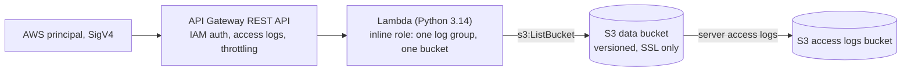

# cdk-python-nag-pipeline-lab

An AWS CDK v2 app in Python, deployed by a self-mutating CDK Pipelines pipeline on AWS CodePipeline. cdk-nag runs
the AWS Solutions rule pack during synth, so any finding that is not acknowledged in code fails the synth and stops
the pipeline before anything reaches CloudFormation.

[](https://github.com/gamaware/cdk-python-nag-pipeline-lab/actions/workflows/ci.yml)
[](LICENSE)


> **Lab.** Harbor Goods and all data here are fictional. Each repository in this portfolio is a
> separate engagement with Harbor Goods, a fictional mid-size retailer. Account IDs are AWS documentation examples.

## What this proves

- **cdk-nag as a hard gate.** `AwsSolutionsChecks` is registered once on the whole app. An unacknowledged finding
  makes `cdk synth` exit non-zero, locally, in CI and inside the pipeline.
- **Accepted findings are written down.** Each acknowledgment targets one construct and, for IAM wildcards, one
  finding ID, with a reason that names the control or scope that limits the risk. No stack-wide suppressions.
- **Generated IAM is checked, not trusted.** Where CDK Pipelines grants more than it needs, the code narrows it: the
  asset publishing role gets an explicit deny on starting or stopping builds.
- **CDK Pipelines in Python.** Source from a CodeConnections connection, tests and synth in CodeBuild,
  self-mutation, a dev stage, a manual approval and a prod stage.
- **Template assertions.** pytest checks the synthesized CloudFormation with `aws_cdk.assertions.Template`, plus a
  test that fails if cdk-nag reports anything.

## Inspect the deliverable

| Artifact | What to look at |
| --- | --- |
| [app.py](app.py) | Required context and the one `AwsSolutionsChecks` registration |
| [pipeline/pipeline_stack.py](pipeline/pipeline_stack.py) | Source, synth step, stages, approval, the asset-role deny |
| [pipeline/nag_suppressions.py](pipeline/nag_suppressions.py) | Acknowledgments for the roles CDK Pipelines generates |
| [service/service_stack.py](service/service_stack.py) | Workload with each acknowledgment next to its resource |
| [tests/unit/test_nag.py](tests/unit/test_nag.py) | The gate: the app is clean, and a plain bucket fails synth |
| [docs/nag-findings.md](docs/nag-findings.md) | How to read a finding and when an acknowledgment is acceptable |

## Scenario and acceptance criteria

Harbor Goods' platform team writes its AWS infrastructure in CDK with Python and runs its pipelines from the
shared-services account (`123456789012`). Reviews keep missing unencrypted buckets, absent access logs and wildcard
grants, and nobody reads the scan reports. The team wants every such change stopped before deploy unless the
exception is written down next to the resource.

Acceptance criteria:

- `cdk synth` fails on any AWS Solutions finding that is not acknowledged, and the pipeline stops at `Build`;
- every acknowledgment names one construct and gives a reason a reviewer can check;
- the pipeline runs the tests before synth and waits for a manual approval before prod;
- all of it verifies offline, with no AWS account or credentials.

## Architecture


Stage order: `Source`, `Build` (synth), `UpdatePipeline`, `Assets`, `Dev`, `Prod`. The first action in `Prod` is the
manual approval `PromoteToProd`. The pipeline stack also owns the account's API Gateway logging role, a setting both
stages share ([ADR 0003](docs/adr/0003-shared-settings-owned-once.md)).

Each stage deploys the same workload stack:



An acknowledged finding, from `service/service_stack.py`:

```python
Validations.of(method).acknowledge(
    Acknowledgment(
        id="AwsSolutions::AwsSolutions-COG4",
        reason=(
            "The method uses IAM (SigV4) authorization. Callers are AWS "
            "principals, so a Cognito user pool authorizer does not apply."
        ),
    )
)
```

## Verify locally

Prerequisites, with the versions CI uses: [uv](https://docs.astral.sh/uv/) 0.12.19 (it installs Python 3.13 and
the packages pinned in `uv.lock`: `aws-cdk-lib` 2.271.0, `cdk-nag` 3.0.2, `constructs` 10.8.1), GNU Make and
Node.js 24 for the CDK CLI 2.1143.0 through `npx`. No AWS account or credentials.

```bash
make setup    # install the pinned toolchain into .venv
make verify   # ruff, pytest, then cdk synth with example context
```

The run ends with:

```text
20 passed
...
verify: all checks passed
```

`make synth` passes example context (`account=123456789012`, a placeholder connection ARN), so synth needs no
credentials.

### Try the gate

Add a bucket without logging or an SSL-only policy to `ServiceStack`:

```python
s3.Bucket(self, "UnsafeBucket")
```

`make verify` now fails with output like:

```text
ERROR The S3 Bucket has server access logs disabled. (AwsSolutions)
   NagLabPipeline/Dev/Service/UnsafeBucket/Resource aws-cdk-lib.aws_s3.CfnBucket
   Acknowledge with 'AwsSolutions::AwsSolutions-S1'

ERROR The S3 Bucket or bucket policy does not require requests to use SSL. (AwsSolutions)
   NagLabPipeline/Dev/Service/UnsafeBucket/Resource aws-cdk-lib.aws_s3.CfnBucket
   Acknowledge with 'AwsSolutions::AwsSolutions-S10'
```

Opened as a pull request, CI fails at `verify`. Pushed to `main`, the pipeline stops at `Build` and nothing is
deployed. Fix the resource or, if the finding is accepted, acknowledge it next to the resource with a reason (see
[docs/nag-findings.md](docs/nag-findings.md)).

### Deploy the pipeline (optional)

1. Fork this repository.
2. In the AWS console, create a CodeConnections connection to GitHub and complete the handshake. Copy its ARN.
3. Bootstrap the account (placeholders shown):

   ```bash
   npx --yes aws-cdk@2.1143.0 bootstrap aws://YOUR_AWS_ACCOUNT_ID/YOUR_REGION
   ```

4. Deploy the pipeline stack once from your machine:

   ```bash
   npx --yes aws-cdk@2.1143.0 deploy NagLabPipeline \
     -c account=YOUR_AWS_ACCOUNT_ID \
     -c region=YOUR_REGION \
     -c repository=YOUR_GITHUB_OWNER/cdk-python-nag-pipeline-lab \
     -c connection_arn=YOUR_CONNECTION_ARN
   ```

5. Push to `main`. From then on the pipeline updates itself: the synth step passes the same context values to
   `cdk synth`, and `UpdatePipeline` applies any change to the pipeline before the stages deploy.
6. Approve `PromoteToProd` in the CodePipeline console to deploy the prod stage.

Context keys: `account`, `region`, `repository` and `connection_arn` are required; `branch` defaults to `main`. The
app refuses to synth when one is missing.

To call the API, sign the request with SigV4, for example with
[awscurl](https://github.com/okigan/awscurl):
`awscurl --service execute-api https://API_ID.execute-api.YOUR_REGION.amazonaws.com/v1/objects`.

Cost: the pipeline, a KMS key (about USD 1 per month), CodeBuild minutes per run, and two copies of a small
serverless workload. Teardown, in this order:

1. The stage stacks: `Prod-Service`, then `Dev-Service` (CloudFormation console, or
   `aws cloudformation delete-stack --stack-name Prod-Service`).
2. The pipeline stack: `npx --yes aws-cdk@2.1143.0 destroy NagLabPipeline -c ...` with the same context. This also
   removes the API Gateway logging role.
3. The CodeConnections connection, if you created it for this lab.

Buckets use `auto_delete_objects`, so stack deletion empties them. The CDK bootstrap stack (`CDKToolkit`) and its
staging bucket stay behind; delete them only if nothing else in the account uses them.

## Repository map

```text
app.py                         entry point, registers AwsSolutionsChecks on the whole app
pipeline/pipeline_stack.py     CodePipeline source, synth step, stages, approval, API Gateway logging role
pipeline/nag_suppressions.py   acknowledged findings on IAM policies that CDK Pipelines generates
service/service_stack.py       workload: S3 buckets, Lambda, API Gateway, scoped function role,
                               each acknowledged finding next to its resource
service/runtime/handler.py     Lambda handler
tests/unit/                    pytest with aws_cdk.assertions, plus the cdk-nag gate tests
docs/nag-findings.md           how to read a finding and when an acknowledgment is acceptable
docs/adr/                      decisions
Makefile                       setup, lint, test, synth, verify
.github/workflows/ci.yml       shared lint and security workflows, then make verify; no AWS credentials
```

## Decisions and trade-offs

Architecture decision records follow the *Fundamentals of Software Architecture* (2nd ed.) format.

| Number | Title | Status |
| --- | --- | --- |
| [0001](docs/adr/0001-cdk-nag-as-a-synth-gate.md) | Run cdk-nag as a validation plugin that fails synth | Accepted |
| [0002](docs/adr/0002-acknowledgments-next-to-the-resource.md) | Acknowledge each accepted finding on its construct, with a reason | Accepted |
| [0003](docs/adr/0003-shared-settings-owned-once.md) | Keep account-wide settings in the pipeline stack, and grant the connection under both prefixes | Accepted |

## Security and quality gates

| Gate | Where | Why |
| --- | --- | --- |
| `make verify`: ruff, pytest, `cdk synth` with cdk-nag | `ci.yml` (`verify`) and the pipeline's synth step | Same command locally and in CI |
| markdownlint, lychee, Vale | `ci.yml`, shared `lint-docs` | Docs stay readable and links stay alive |
| actionlint, zizmor | `ci.yml`, shared `lint-actions` | Workflow syntax and known-bad patterns |
| gitleaks | `ci.yml`, shared `secrets` | No credentials in history |
| Semgrep, Trivy | `ci.yml`, shared `security` | Python code and dependency vulnerabilities |

The workflow starts from `permissions: {}` and grants `contents: read` per job; actions and the shared workflows are
pinned to full commit SHAs. No job receives cloud credentials or an `id-token`. Pre-commit runs ruff, gitleaks,
markdownlint, actionlint, file hygiene checks and conventional commit messages.

## Limits and production adaptations

- **One account.** Dev and Prod deploy to the pipeline's own account. A real setup passes a different `env` to each
  stage, bootstraps the target accounts with `--trust` for the pipeline account and sets `cross_account_keys=True`.
- **Some generated grants stay broad.** The asset publishing role keeps CodeBuild log and report access on every
  project in the account, and the self-mutation role keeps `Resource: *` for `cloudformation:DescribeStacks`. Each is
  acknowledged with its real scope in `pipeline/nag_suppressions.py`.
- **API Gateway logging uses the AWS managed policy**, which can read and write every log group in the account.
- **No AWS WAF on the API.** IAM authorization and stage throttling are the controls; the APIG3 finding is
  acknowledged for cost.
- **One rule pack.** `HIPAASecurityChecks`, `NIST80053R5Checks`, `PCIDSS321Checks` or `ServerlessChecks` register
  next to `AwsSolutionsChecks` in `app.py`, and each adds its own findings.
- **The lab is not deployed by CI.** Tests and synth prove what the templates contain, not how IAM evaluates them.

## Related work

- [AWS DevOps portfolio](https://github.com/gamaware/aws-devops-portfolio): the index of every lab and sample
  deliverable.
- [github-actions-aws-oidc-lab](https://github.com/gamaware/github-actions-aws-oidc-lab): the same kind of gated
  pipeline with GitHub Actions and Terraform.

## License

[MIT](LICENSE)
